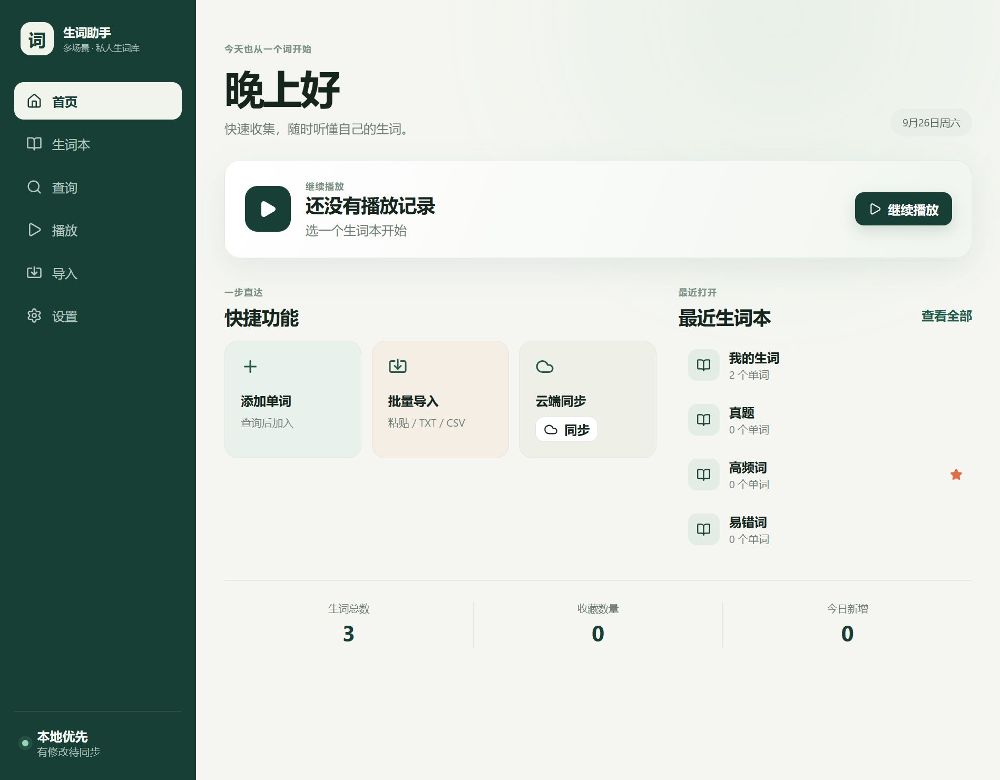
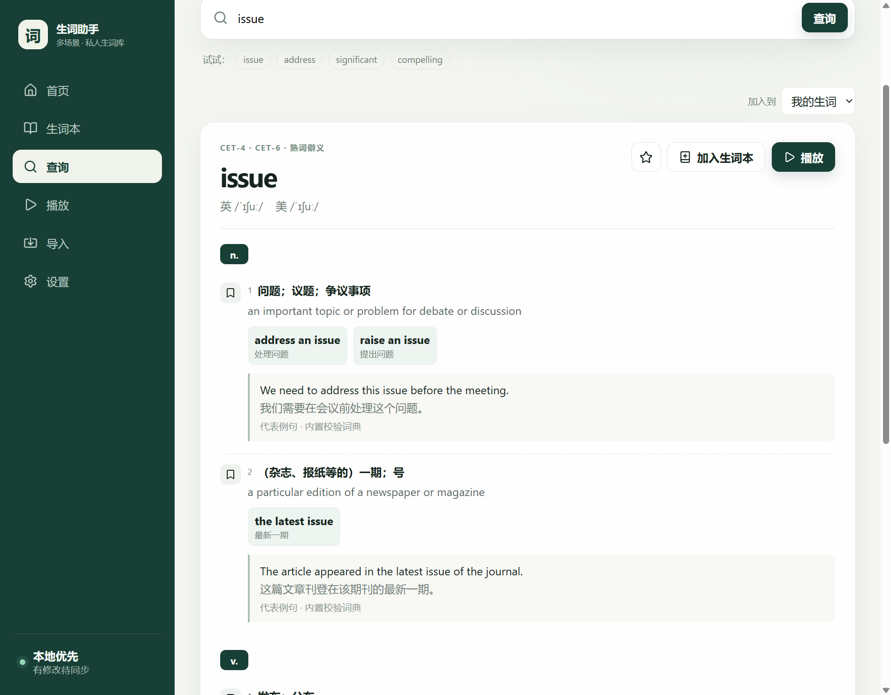
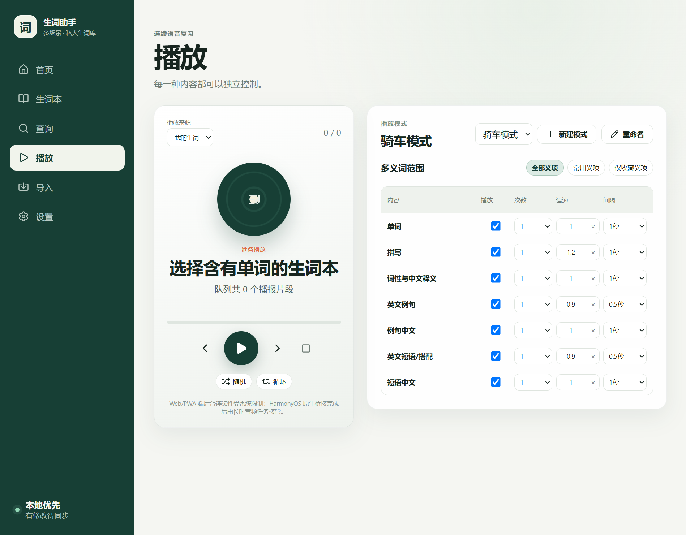

# 生词助手 Word Assistant

一个本地优先、跨平台、可高度自定义播放顺序的开源生词工具。适合四六级、考研、雅思、托福以及日常阅读中的生词收集与复习。

[](https://github.com/mmcc65/word-assistant/releases/latest)
[](LICENSE)
[](#支持平台)

> 快速收集生词，保留完整义项，再按照自己的节奏连续播放单词、拼写、词性、释义、例句和短语。

## 界面预览

### 本地优先首页



### 结构化查询



### 自定义连续播放



## 主要功能

- **本地优先**：词条、生词本、收藏、备注和播放设置首先保存在 IndexedDB；没有账号、没有网络也能使用已有内容。
- **结构化词条**：按“单词 → 词性 → 义项”保存中英文释义、音标、例句、短语、来源、频率标签和个人备注。
- **离线词典**：内置 36,624 条 ECDICT 英汉词条；本地没有的词才尝试调用公开词典服务。
- **多生词本管理**：支持树形文件夹、收藏、搜索、重命名、删除以及同一单词加入多个生词本。
- **批量导入**：支持直接粘贴、TXT 和 CSV，提供预览、清洗、去重、失败列表及安全合并。
- **精细播放方案**：单词、拼写、词性与中文释义、英文例句、例句中文、英文短语、短语中文均可单独控制开关、次数、语速和间隔。
- **自然播放顺序**：每个短语后紧接中文解释，每个例句后紧接中文翻译；多义项可选择全部、常用或仅收藏义项。
- **标准英文发音**：单词优先使用词典标准录音；拼写逐字母播放；短语和例句使用完整英文语音。中文内容使用系统中文语音。
- **导出与恢复**：一键导出 JSON 备份，便于迁移设备或升级前留档。
- **可选云同步**：支持 Supabase 邮箱账户、本地优先快照同步、离线更新时间合并和删除墓碑。
- **安全自动更新**：Windows 版可检查 GitHub Release、下载更新包、验证 SHA-256、替换程序并自动重启。
- **响应式布局**：桌面使用侧栏和多列布局，手机使用底部导航，平板自动适配宽屏。

## 支持平台

| 平台 | 状态 | 说明 |
|---|---|---|
| Windows 10/11 | 可用 | WebView2 自包含桌面版，支持应用内安全更新 |
| Web / PWA | 可用 | 支持现代 Chromium 浏览器，可安装为 PWA |
| Android / HarmonyOS 4.x | 工程可构建 | Capacitor APK 工程；系统安装更新仍需用户确认 |
| HarmonyOS NEXT / HarmonyOS 6 | 实验性工程 | ArkWeb/HAP 工程已提供，需要 DevEco Studio 和签名配置 |

## 直接使用

### Windows

1. 打开 [Releases](https://github.com/mmcc65/word-assistant/releases/latest)。
2. 下载 `WordAssistant-desktop-release.zip`。
3. 解压整个文件夹；不要只取出单个 EXE。
4. 运行 `生词助手.exe`。
5. 以后可在“设置 → 检查更新”中直接升级。

Windows 桌面版的数据与缓存不会打进更新包。升级程序只替换应用文件，不会删除生词数据库。

### Web / PWA

项目可以部署到任意支持 HTTPS 和 SPA 回退的静态站点。浏览器打开后，可使用“安装应用”或“添加到桌面”安装 PWA。Service Worker 只用于浏览器版本；Windows、Android 等打包壳会主动注销它，避免更新后继续加载旧资源。

## 从源码运行

### 环境要求

- Node.js 22 或更高版本
- pnpm 10 或更高版本
- Windows 桌面构建：.NET SDK 7
- Android 构建：JDK 21、Android SDK
- HarmonyOS 构建：DevEco Studio、对应 HarmonyOS SDK 与签名

```powershell
git clone https://github.com/mmcc65/word-assistant.git
cd word-assistant
pnpm install
pnpm dev
```

浏览器打开终端显示的地址，通常为 `http://localhost:5173`。

常用命令：

```powershell
pnpm test              # 自动测试
pnpm check             # TypeScript 类型检查
pnpm build             # Web/PWA 生产构建
pnpm desktop:build     # Windows 自包含桌面版
pnpm android:sync      # 构建并同步到 Android 工程
pnpm harmony:sync      # 构建并同步到 HarmonyOS 工程
```

## 导入格式

最简单的 TXT 内容可以是一行一个词：

```text
compelling
controversy
equivalent
```

CSV 可包含 `word`、`phonetic`、`definition`、`translation`、`tags`、`notes` 等字段。导入前会显示预览；已有词条会合并来源、义项、例句和短语，不会覆盖非空的个人备注。

## 播放方式

1. 在“查询”中添加单词，或在“导入”中批量建立生词本。
2. 打开“播放”，选择整个生词库或指定生词本。
3. 选择内置方案，或新建自己的播放方案。
4. 分别设置七类内容的播放次数、语速和间隔。
5. 选择顺序、随机、循环，以及全部/常用/收藏义项范围。

播放队列按内容配对：`英文短语 → 短语中文`、`英文例句 → 例句中文`，不会先读完全部英文再集中翻译。

## 可选云同步

不配置云服务也能完整使用本地功能。若需要多设备同步：

1. 创建 Supabase 项目并启用邮箱认证。
2. 在 SQL Editor 执行 [`supabase/migrations/202609250001_create_user_snapshots.sql`](supabase/migrations/202609250001_create_user_snapshots.sql)。
3. 复制配置文件：

```powershell
Copy-Item .env.example .env.local
```

4. 填写公开的客户端配置：

```dotenv
VITE_SUPABASE_URL=https://your-project.supabase.co
VITE_SUPABASE_PUBLISHABLE_KEY=your-publishable-key
```

前端只能使用 Publishable Key（旧项目可使用 anon key），不要填写 `service_role` 或其他 secret key。数据库迁移已启用 RLS，并限制用户只能访问自己的快照。

## 数据与隐私

- 生词数据默认只保存在当前设备。
- 开启同步后，数据发送到你自行配置的 Supabase 项目。
- 标准单词录音来自公开词典音频服务；播放拼写、英文短语和英文例句时，对应英文文本可能发送到在线 TTS 服务。
- 项目不会上传本地 JSON 备份、Windows WebView 数据、账号密码或服务端密钥。
- `.env.local`、`app-data/`、`backups/`、编译缓存和签名文件均已加入忽略规则。

## 项目结构

```text
src/                 React UI、领域模型、Provider、本地存储与同步
public/dictionaries/ ECDICT 离线词典子集及来源说明
platforms/windows/   Windows WebView2 原生壳与安全更新器
android/             Capacitor Android 工程
platforms/harmony/   HarmonyOS ArkWeb/HAP 工程
supabase/            云同步迁移与 RLS 测试
scripts/             词典、图标和多平台构建脚本
docs/                架构、设备验证记录和项目截图
```

更详细的设计见 [`docs/ARCHITECTURE.md`](docs/ARCHITECTURE.md)，真机与构建状态见 [`docs/DEVICE_VALIDATION.md`](docs/DEVICE_VALIDATION.md)。

## 测试

当前自动测试覆盖导入、去重与安全合并、多对多生词本关系、播放队列、逐条短语/例句翻译、中文词性、缓存生命周期、同步合并、数据库迁移、离线词典和语音选择。

```powershell
pnpm test
pnpm check
pnpm build
```

## 技术栈

- React 19 + TypeScript + Vite
- IndexedDB + Service Worker / PWA
- Capacitor Android
- WPF + Microsoft WebView2
- HarmonyOS ArkTS + ArkWeb
- Supabase Auth + Postgres（可选）
- Vitest

## 词典与第三方服务

- 离线词典基于 [skywind3000/ECDICT](https://github.com/skywind3000/ECDICT)，采用其 MIT 许可；详细来源见 `public/dictionaries/ecdict/`。
- 未命中离线词典时，可回退到 [Free Dictionary API](https://dictionaryapi.dev/)。
- 在线音频与 TTS 的可用性和使用条款由相应服务提供方决定；生产部署建议替换为自己有权使用的音频服务或后端代理。

## 贡献

欢迎提交 Issue 和 Pull Request。开始前请阅读 [`CONTRIBUTING.md`](CONTRIBUTING.md)。提交代码时请确保类型检查、测试和生产构建通过，并且不要提交用户数据、密钥、签名文件或第三方受限词典内容。

## 开源许可

项目代码采用 [MIT License](LICENSE)。第三方词典、图标、运行库和在线服务保留各自许可与条款。
